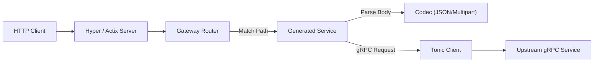

# gRPC Gateway for Rust

[](https://www.rust-lang.org)
[](https://github.com/hyperium/tonic)
[](https://github.com/tokio-rs/prost)
[](https://github.com/tower-rs/tower)
[](https://tokio.rs)
[](https://hyper.rs)
[](https://actix.rs)
[](https://serde.rs)
[](LICENSE)

> **⚠️ WARNING: Work In Progress ⚠️**
>
> This project is currently under **active development**. It is an early version intended for **testing and experimentation purposes only**.
> It has **NOT** been verified in production environments. Breaking changes may occur at any time.

A high-performance, `protoc` plugin that generates a reverse proxy server to translate a RESTful HTTP API into gRPC. This project allows you to expose your gRPC services as
HTTP/JSON endpoints defined by `google.api.http` annotations, maintaining a single source of truth in your Protocol Buffers definitions.

> **Note:** This project is a Rust implementation inspired by the Go [grpc-gateway](https://github.com/grpc-ecosystem/grpc-gateway).

---

## 📖 Table of Contents

- [Introduction](#introduction)
- [Features](#features)
- [Architecture](#architecture)
- [Prerequisites](#prerequisites)
- [Getting Started](#getting-started)
- [Runtime Features](#runtime-features)
- [Advanced Usage](#advanced-usage)
- [Examples](#examples)
- [Roadmap](#roadmap)
- [Contributing](#contributing)

---

## Introduction

`grpc-gateway-rust` reads Protocol Buffer service definitions and generates a reverse-proxy server which translates a RESTful JSON API into gRPC. This server is generated according
to the `google.api.http` annotations in your `.proto` files.

This approach helps you:

- **Design API First**: Use Protocol Buffers as the single source of truth.
- **Support Legacy Clients**: Provide HTTP/JSON APIs for clients that do not support gRPC.
- **Automate Boilerplate**: Eliminate the need to manually write HTTP handlers and mappers.

## Features

* **JSON Transcoding**: Automatically converts JSON request bodies to Protobuf messages and vice-versa using `serde`.
* **Standard Annotations**: Full support for `google.api.http` options (verbs, paths, body mappings).
* **Type Safety**: Generated code leverages Rust's strong type system for compile-time verification of routes.
* **Multipart Support**: Built-in support for `multipart/form-data` uploads using `multer`.
* **Streaming Responses**: Supports server-side streaming responses (file downloads, event streams) via `http-body`.
* **Ecosystem Native**: Built on top of the best-in-class Rust async ecosystem:
    * **[Tonic](https://github.com/hyperium/tonic)**: For gRPC implementation.
    * **[Prost](https://github.com/tokio-rs/prost)**: For Protocol Buffers serialization.
    * **[Hyper](https://hyper.rs)**: For low-level HTTP implementation.
    * **[Tower](https://github.com/tower-rs/tower)**: For robust middleware and service composition.

## Architecture

The project is organized as a workspace with the following crates:

| Crate                         | Description                                                                                                                      |
|-------------------------------|----------------------------------------------------------------------------------------------------------------------------------|
| **`protoc-gen-grpc-gateway`** | The `protoc` plugin executable. It parses `.proto` files and outputs Rust code. [See detailed usage](gateway-codegen/README.md). |
| **`gateway-runtime`**         | The library required by generated code. Handles routing, marshaling, and error mapping.                                          |
| **`gateway-annotations`**     | Parses `google.api.http` options from the `descriptor.proto`.                                                                    |
| **`gateway-internal`**        | Shared internal models used by both codegen and runtime.                                                                         |

### Request Flow



## Prerequisites

- **Rust**: Stable toolchain (1.70+ recommended).
- **Protobuf Compiler**: `protoc` installed and available in your `$PATH`.

## Getting Started

### 1. Add Dependencies

Update your `Cargo.toml` to include the necessary dependencies. You will need `tonic`, `prost`, and the gateway runtime.

```toml
[dependencies]
tonic = "0.14"
prost = "0.14"
serde = { version = "1.0", features = ["derive"] }
tokio = { version = "1.0", features = ["macros", "rt-multi-thread"] }
gateway-runtime = { version = "0.2" }

[build-dependencies]
tonic-build = "0.14"
tonic-prost-build = "0.14"
```

### 2. Define Service

Create a `.proto` file (e.g., `proto/service.proto`). Import `google/api/annotations.proto` and define your HTTP mappings.

```protobuf
syntax = "proto3";
package example;

import "google/api/annotations.proto";

service Greeter {
  rpc SayHello (HelloRequest) returns (HelloReply) {
    option (google.api.http) = {
      post: "/v1/example/echo"
      body: "*"
    };
  }
}

message HelloRequest {
  string name = 1;
}

message HelloReply {
  string message = 1;
}
```

### 3. Configure Build Script

In your `build.rs`, configure `tonic-prost-build` to use the `grpc-gateway-rust` plugin.

**Important**: You must enable `serde` serialization for generated types.

```rust,ignore
fn main() {
    let root = std::path::PathBuf::from(std::env::var("CARGO_MANIFEST_DIR").unwrap());
    let out_dir = std::path::PathBuf::from(std::env::var("OUT_DIR").unwrap());

    // Ensure the plugin is built or available in PATH
    // In this repo, we point to the local debug build
    let plugin_path = root.join("../target/debug/protoc-gen-grpc-gateway");

    tonic_prost_build::configure()
        // 1. Enable Serde for JSON transcoding
        .type_attribute(".", "#[derive(serde::Serialize, serde::Deserialize)]")
        .message_attribute(".", "#[serde(default)]")
        .compile_well_known_types(true)

        // 2. Configure the Gateway Plugin
        .protoc_arg("--experimental_allow_proto3_optional")
        .protoc_arg(format!("--plugin=protoc-gen-grpc-gateway-rust={}", plugin_path.display()))
        // The generator now defaults to source_relative=true, matching tonic behavior
        .protoc_arg(format!("--grpc-gateway-rust_out={}", out_dir.join("gateway").display()))
        // Options:
        // --grpc-gateway-rust_opt=paths=import (disable source_relative)
        // --grpc-gateway-rust_opt=no_include (disable mod.rs include! generation)

        // 3. Compile
        .compile_protos(&["proto/service.proto"], &["proto/"])
        .unwrap();
}
```

### 4. Implement Gateway

In `src/main.rs`, set up the Hyper server and register your gRPC client with the generated Gateway `Router`.

```rust,ignore
use gateway_runtime::{Gateway, Router};
use gateway_runtime::codec::JsonCodec;
use tonic::transport::Channel;

// Include generated code (adjust path as needed)
pub mod pb {
    tonic::include_proto!("example");
    // Include the gateway generated code
    // The plugin now generates a mod.rs with include! macros automatically if source_relative is enabled (default)
    // You can also include the generated file directly if preferred.

    // Example assuming typical output structure in OUT_DIR/gateway/example/
    // include!(concat!(env!("OUT_DIR"), "/gateway/example/mod.rs"));

    // Or direct include of the gateway file:
    include!(concat!(env!("OUT_DIR"), "/gateway/example/example.gw.rs"));
}

#[tokio::main]
async fn main() -> Result<(), Box<dyn std::error::Error>> {
    // 1. Create the gRPC client
    let channel = Channel::from_static("http://[::1]:50051").connect().await?;
    let client = pb::GreeterClient::new(channel);

    // 2. Create the Gateway Router
    let mut router = Router::new();

    // 3. Register the service
    // The generator creates `{ServiceName}Registration` within the service module `{service_name}_gw`
    pb::example::greeter_gw::GreeterRegistration::register_greeter(&mut router, client, JsonCodec);

    // 4. Create the Gateway Service with secure defaults
    // This adds standard middleware (Error handling, Request ID, etc.)
    let gateway_service = Gateway::new(router).into_service();

    // 5. Run the HTTP Server (using Hyper)
    // See `examples/` for the full Hyper service boilerplate
    println!("Gateway listening on http://127.0.0.1:8080");
    // ... Hyper server setup usage of gateway_service ...

    Ok(())
}
```

## Runtime Features

The `gateway-runtime` (v0.2.0+) includes a comprehensive suite of middleware layers built on [Tower](https://github.com/tower-rs/tower).

### Secure Defaults

When initialized via `Gateway::new(router)`, the service comes pre-configured with:

* **Error Handling**: Automatically converts gRPC errors to standard JSON responses (`{ "code": 404, "message": "...", ... }`).
* **Security Headers**: Filters unsafe headers (`Authorization`, `Host`) from being forwarded upstream unless explicitly allowed.
* **Request ID**: Securely generates a unique `x-request-id` for every request to ensure traceability.
* **Response Modification**: Supports `x-http-code` gRPC metadata to override HTTP status codes.

### Customizable Hooks

You can extend the default behavior using the builder pattern:

```rust,ignore
let gateway = Gateway::new(router)
    // Add custom response processing
    .with_response_modifier(|req, resp| {
        resp.headers_mut().insert("x-custom-header", "value".parse().unwrap());
    })
    // Configure path unescaping (e.g. for /v1/example/foo%20bar)
    .with_unescaping_mode(UnescapingMode::AllCharacters)
    // Add Metrics/Tracing hooks
    .with_metrics_recorder(|req, res, duration| {
        println!("Request to {} took {:?}", req.uri().path(), duration);
    })
    .into_service();
```

## Advanced Usage

### Custom Codec

You can implement the `Codec` trait to support formats other than JSON (e.g., Protobuf binary, YAML).

```rust,ignore
struct MyCustomCodec;

impl Codec for MyCustomCodec {
    const CONTENT_TYPE: &'static str = "application/x-custom";
    // ... implement encode/decode
}
```

## Multipart Support

The gateway supports `multipart/form-data` for file uploads. If a method accepts a message where fields map to multipart parts (e.g. `bytes content = 2; string filename = 1;`), the
gateway will parse the multipart body and populate the message fields.

Example Proto:

```protobuf
message CreateFileRequest {
  string filename = 1;
  bytes content = 2;
}

rpc CreateStoredFile(CreateFileRequest) returns (StoredFile) {
  option (google.api.http) = {
    post: "/v1/files"
    body: "*"
  };
}
```

## Load Balancing

You can configure client-side load balancing using `tonic::transport::Channel`.

```rust,ignore
use tonic::transport::{Channel, Endpoint};
use std::time::Duration;

let endpoints = vec!["http://127.0.0.1:9090", "http://127.0.0.1:9091"];
let channel = Channel::balance_list(
    endpoints.into_iter()
        .map(|e| Endpoint::from_static(e).timeout(Duration::from_secs(5)))
);
```

See [`examples/src/load_balancing/gateway.rs`](examples/src/load_balancing/gateway.rs) for a complete example.

## Examples

Check the [`examples/`](examples/) directory for a complete, compilable workspace that demonstrates various scenarios:

* **`a_bit_of_everything`**: A full-featured example showcasing most supported features (verbs, path params, body mapping, query params, etc.).
* **`multipart`**: Demonstrates file uploads and streaming downloads.
* **`load_balancing`**: Shows how to configure the gateway with a load-balanced Tonic channel.
* **`actix_integration`**: Demonstrates how to mount the gateway router within an Actix Web application.

To run the examples:

```bash
# Run the gRPC server
cargo run -p gateway-examples --bin example-aboe-grpc

# Run the Gateway server
cargo run -p gateway-examples --bin example-aboe-gateway
```

## Roadmap

This project is in its early stages. Future planned features include:

*   [ ] Full Query Parameter support (nested fields, repeated fields, filtering).
*   [ ] WebSocket support for bidirectional streaming.
*   [ ] OpenAPI (Swagger) generation from annotations.
*   [ ] Comprehensive integration tests suite.
*   [ ] Performance benchmarks vs Go implementation.
*   [ ] Support for `google.api.http.custom` verbs.

## Contributing

Contributions are welcome!

1. Fork the repository.
2. Create a feature branch.
3. Add tests for your changes.
4. Run `cargo test` to ensure everything passes.
5. Submit a Pull Request.

## License

This project is licensed under the Apache License Version 2.0 - see the [LICENSE](LICENSE) file for details.
